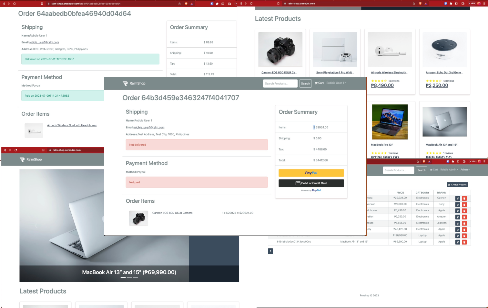

# ralm-shop

#### eCommerce platform built with the MERN stack & Redux.



## Features

- Full featured shopping cart
- Product reviews and ratings
- Top products carousel
- Product pagination
- Product search feature
- User profile with orders
- Admin product management
- Admin user management
- Admin Order details page
- Mark orders as delivered option
- Checkout process (shipping, payment method, etc)
- PayPal / credit card integration
- Database seeder (products & users)

# Usage

- Create a MongoDB database and obtain your `MongoDB URI` - [MongoDB Atlas](https://www.mongodb.com/cloud/atlas/register)
- Create a PayPal account and obtain your `Client ID` - [PayPal Developer](https://developer.paypal.com/)

### Env Variables

Rename the `.env.example` file to `.env` and add the following

```
NODE_ENV=sample
PORT=sample
MONGO_URI=sample
JWT_SECRET=sample
PAGINATION_LIMIT=sample
AWS_S3_ACCESS_KEY_ID=sample
AWS_S3_SECRET_ACCESS_KEY=sample
AWS_S3_BUCKET_NAME=sample
AWS_S3_REGION=sample
```

Change the JWT_SECRET and PAGINATION_LIMIT to what you want

### Install Dependencies (frontend & backend)

```
pnpm install
cd frontend
pnpm install
```

### Run

```

# Run frontend (:3000) & backend (:5000)
pnpm run dev

# Run backend only
pnpm run server
```

## Build & Deploy

```
# Create frontend prod build
cd frontend
pnpm run build:frontend
```

### Seed Database

You can use the following commands to seed the database with some sample users and products as well as destroy all data

```
# Import data
pnpm run data:import

# Destroy data
pnpm run data:destroy
```
